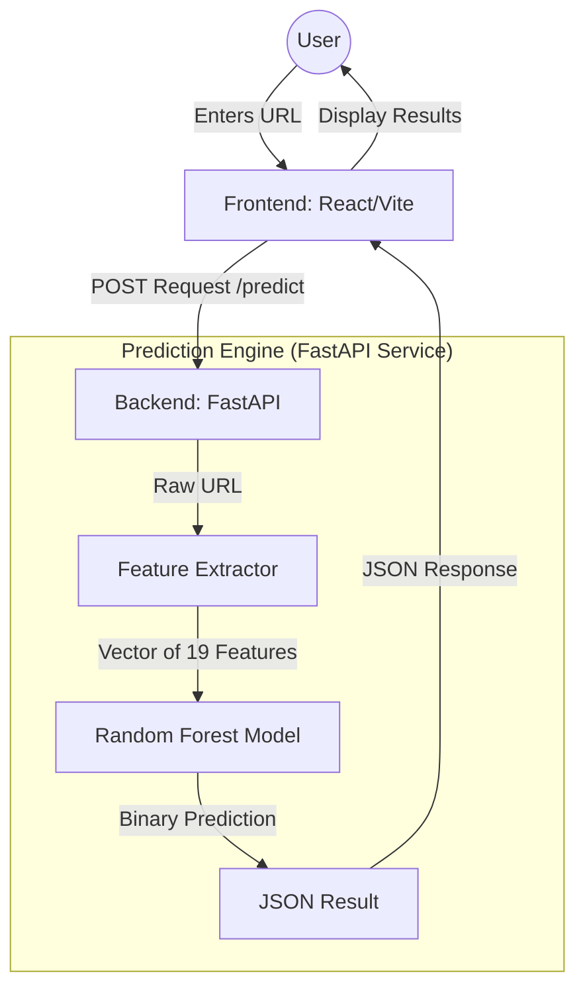

# 🔍 Phishing URL Detection using Machine Learning

This project aims to detect phishing websites using URL-based machine learning techniques. The model analyzes lexical and structural patterns in URLs and predicts whether a given URL is **legitimate** or **phishing** with extremely high accuracy.

---

## 🌐 Live Demo
- **Frontend (UI)**: [https://phishing-website-detection-livid.vercel.app](https://phishing-website-detection-livid.vercel.app)
- **Backend (API)**: [https://phishing-website-detection-lqcg.onrender.com](https://phishing-website-detection-lqcg.onrender.com)

---

## 🏗️ System Design & Architecture

The project follows a modern decoupled architecture consisting of a client-side interface and a high-performance machine learning microservice.

### High-Level Architecture

### Request Flow
1.  **Capture**: The user enters a URL in the React-based frontend.
2.  **Dispatch**: The frontend sends a JSON payload containing the URL to the `/predict` endpoint of the FastAPI backend.
3.  **Feature Extraction**: The backend uses a custom lexical analyzer (`extract_features.py`) to transform the raw string into 19 mathematical features (length, entropy, brand keywords, etc.).
4.  **Inference**: The feature vector is passed to the pre-trained **Random Forest** model (serialized via `joblib`).
5.  **Response**: The system returns the classification result (`legitimate` or `phishing`) along with a confidence probability.
6.  **AI Insight (Optional)**: If configured with a Gemini API key, the frontend provides a secondary natural language explanation of the threat.

---

## 🚀 Project Overview

Phishing attacks are one of the most common cyber threats used to steal user credentials, financial information, and sensitive data.  
This project uses **Machine Learning** to automatically classify URLs as:

- ✔️ **Legitimate**
- ⚠️ **Phishing**

The model is trained on a large dataset of **100K+ URLs**, extracted from real-world sources and enriched with feature engineering.

---

## 🧠 Technical Stack

- **Frontend**: React, Vite, TypeScript, TailwindCSS
- **Backend**: FastAPI (Python), Uvicorn
- **Machine Learning**: Scikit-Learn (Random Forest Classifier), Pandas, NumPy
- **Deployment**: Vercel (Frontend), Render (Backend via Docker)

---

## 🧪 Model Performance
**Best Model:** Random Forest  

| Metric | Score |
|--------|-------|
| Accuracy | **0.9995** |
| Precision | **0.9999** |
| Recall | **0.9992** |
| ROC-AUC | **0.99999** |

---

## 💻 Local Setup

### Backend (Python)
1. Navigate to the root directory.
2. Create a virtual environment: `python -m venv venv`
3. Activate it: `.\venv\Scripts\activate` (Windows) or `source venv/bin/activate` (Mac/Linux).
4. Install dependencies: `pip install -r requirements.txt`
5. Run the server: `python -m uvicorn src.app:app --reload`

### Frontend (React)
1. Navigate to the `frontend` folder.
2. Install dependencies: `npm install`
3. Set your backend URL in `.env`: `VITE_API_BASE=http://localhost:8000`
4. Run the development server: `npm run dev`

---

## 📂 Dataset Details

- Total samples: **101,218**
- Class distribution:
  - **63,678 legitimate URLs**
  - **37,540 phishing URLs**
- Source: Public cybersecurity dataset (ScienceDirect) + OpenPhish feed

---

## 🤝 Contributing
Feel free to fork this project and submit pull requests for features like:
- Additional ML model comparisons.
- Deep Learning (LSTM/CNN) implementations for URL analysis.
- Real-time threat intelligent feeds integration.
